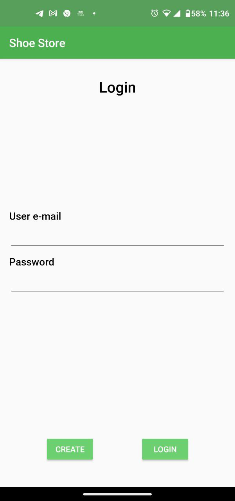
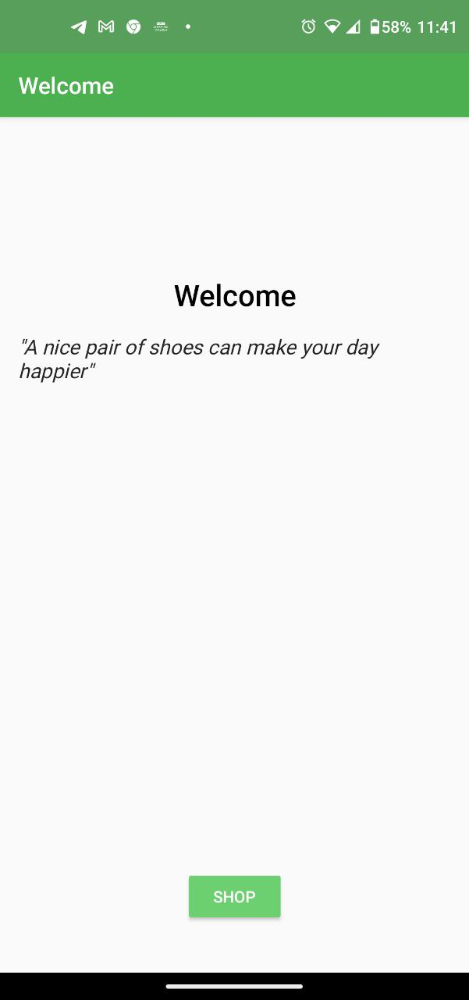
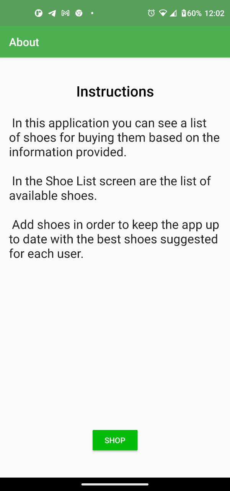
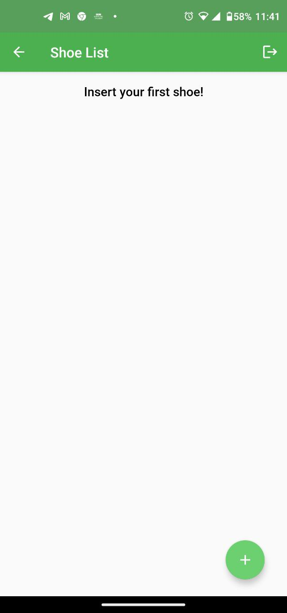
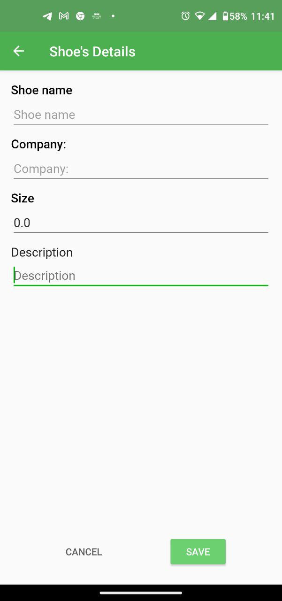
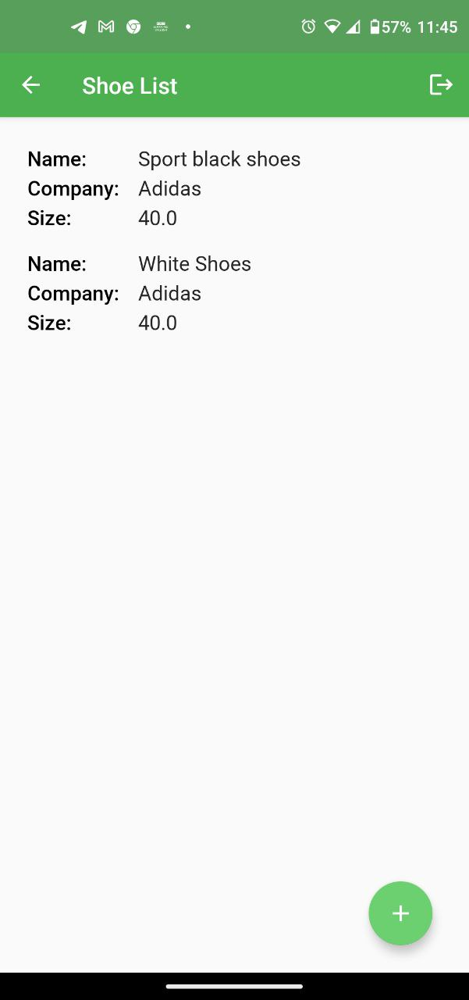

# Shoe Store Project

<!-- TABLE OF CONTENTS -->

  
Table of Contents

  
  * [Project Overview](#project-overview)
      + [Related Articles](#related-articles)
  * [Project Specifications](#project-specifications)
  * [Screenshots](#screenshots)
  * [License](#license)
  

## Project Overview

Shoe Store app is the first project in the Android Kotlin Nanodegree Program from Udacity, it allow the user to store shoes they like.
  
The app follows the [app architecure](https://developer.android.com/topic/architecture) and therefore uses several components from the [Android Jetpack library](https://developer.android.com/jetpack) such as:
* Create layouts with [ConstraintLayouts](https://developer.android.com/training/constraint-layout) that promote a flat view architecture and adapts to many screen sizes.
* [Navigation component](https://developer.android.com/guide/navigation). [Transitions, animations](https://developer.android.com/guide/navigation/navigation-animate-transitions) between and in screens.
* [SafeArgs](https://developer.android.com/guide/navigation/navigation-pass-data#Safe-args) a [Gradle plugin](https://developer.android.com/studio/releases/gradle-plugin) that provides type safety when navigating and passing data between [destinations](https://developer.android.com/guide/navigation/navigation-create-destinations).
* [DataBinding library](https://developer.android.com/topic/libraries/data-binding). Create [observables](https://developer.android.com/reference/android/databinding/BaseObservable) objects in order to enable [two-ways-databinding](https://developer.android.com/topic/libraries/data-binding/two-way) operations.
* [Lifecycle-aware components](https://developer.android.com/topic/libraries/architecture/lifecycle):
    * [ViewModel](https://developer.android.com/topic/libraries/architecture/viewmodel) and [SharedViewModel](https://developer.android.com/topic/libraries/architecture/viewmodel#sharing).
    * [LiveData](https://developer.android.com/topic/libraries/architecture/livedata) as observables objects.

<h4>Related articles:</h4>

* Google I/O 2018 app — Architecture and Testing, read the [article](https://medium.com/androiddevelopers/google-i-o-2018-app-architecture-and-testing-f546e37fc7eb) from Medium
* When to use ConstraintLayout vs LinearLayout, check out this [article](https://karishma-agr1996.medium.com/linear-layout-v-s-constraint-layout-6b64e7a08ed7) from Medium.
* ViewModels and LiveData: Patterns + AntiPatterns [article](https://medium.com/androiddevelopers/viewmodels-and-livedata-patterns-antipatterns-21efaef74a54)

<a href="#top"> <strong>⬆ Back to top </strong> </a> 

## Project Specifications
The project meet [these](https://review.udacity.com/#!/rubrics/2849/view) requirements suggested by Udacity.

<a href="#top"> <strong>⬆ Back to top </strong> </a> 

## Screenshots

    
    

  
  

  
  

<a href="#top"> <strong>⬆ Back to top </strong> </a> 

## License

The source code of this project is under the  [MIT license](/LICENSE)

<a href="#top"> <strong>⬆ Back to top </strong> </a> 

